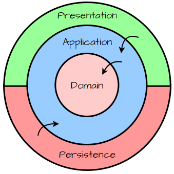
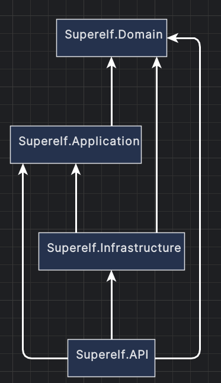

<div align="center">

# SUPERELF

*A Fanstasy Football Application*

[](https://github.com/yorickteriele/Superelf/commits)
[](https://github.com/yorickteriele/Superelf)
[](https://github.com/yorickteriele/Superelf)

*Built with:*

[](https://dotnet.microsoft.com/)
[](https://reactjs.org/)
[](https://www.typescriptlang.org/)
[](https://www.postgresql.org/)
[](https://www.docker.com/)
[](https://github.com/features/actions)
[](https://dotnet.microsoft.com/apps/aspnet/signalr)

</div>


## Table of Contents

- [Overview](#overview)
- [Getting Started](#getting-started)
  - [Prerequisites](#prerequisites)
  - [Installation](#installation)
  - [Usage](#usage)
  - [Testing](#testing)

---

## Overview

Superelf is a fantasy football pool application where users can create and join pools, manage their fantasy teams, and compete with friends. Built with modern technology stack and clean architecture principles, it provides a seamless and engaging fantasy football experience.

Key features include:

- **Player Management:** Create and manage your fantasy football team with real football players
- **Pool System:** Create or join pools with friends and compete throughout the season
- **Live Updates:** Real-time match statistics and point calculations using SignalR
- **Team Statistics:** Track your team's performance with detailed statistics and rankings
- **User-friendly Interface:** Modern React-based interface for seamless team management

## Architecture & Technical Design

Superelf follows Clean Architecture principles to ensure maintainability, testability, and scalability. Here's an overview of the technical design:

### System Architecture

The application architecture is designed to handle real-time fantasy football operations efficiently. Here's how it works:

#### Frontend Layer
We built the frontend using React and TypeScript, creating a responsive Single Page Application (SPA). When a user interacts with the app:
1. The TypeScript-based components ensure type safety across the entire frontend codebase
2. SignalR client maintains a persistent WebSocket connection to receive live match updates
3. React's state management handles real-time data updates without page refreshes
4. Components adapt dynamically to different screen sizes for mobile and desktop users

#### Backend Services
The .NET 8 backend implements Clean Architecture with four distinct layers:



1. **Domain Layer** - Contains all fantasy football business rules and entities
   - Player statistics calculations
   - Team composition rules
   - Point calculation logic
   
2. **Application Layer** - Orchestrates the flow of data and enforces business rules
   - Handles team management operations
   - Processes live match data
   - Manages pool competitions
   
3. **Infrastructure Layer** - Handles external concerns
   - Entity Framework Core for database operations
   - External football data API integrations
   - File storage for player images
   
4. **API Layer** - Manages communication with clients
   - RESTful endpoints for CRUD operations
   - SignalR hubs for real-time updates
   - JWT authentication for secure access



#### Data Management
PostgreSQL serves as our database foundation because:
1. It efficiently handles complex fantasy football relationships:
   - Players belonging to multiple teams
   - Pool standings calculations
   - Match statistics aggregation
2. The migration system allows for safe schema evolution as features grow
3. JSON support enables flexible storage of varying match data structures

### Container Architecture

Our deployment architecture uses containerization to ensure reliability and scalability. Here's how the pieces fit together:

#### Traffic Flow
1. User requests first hit the Nginx reverse proxy, which:
   - Terminates SSL connections for security
   - Routes API requests to the appropriate backend container
   - Serves static frontend files directly for better performance
   - Distributes load across multiple backend instances when scaled

#### Service Organization
The application is split into three main containerized services:
1. **Frontend Container**
   - Builds the React application for production
   - Serves optimized static files through Nginx
   - Configured per environment (test/production)

2. **Backend API Container**
   - Runs the .NET application in a lightweight container
   - Connects to the database using environment-specific settings
   - Scales horizontally for high availability

3. **Database Container**
   - Persists PostgreSQL data in a dedicated volume
   - Runs with optimized settings for fantasy football workloads
   - Automatically backs up data for disaster recovery

#### Deployment Process
Our CI/CD pipeline automates the entire deployment:
1. Code changes trigger GitHub Actions workflows
2. Automated tests run in isolated containers
3. Docker images are built and tagged for the specific environment
4. New versions are deployed with zero-downtime updates
5. Health checks ensure successful deployment

### Key Technical Decisions

Our technical choices were driven by specific needs of a fantasy football application:

#### Clean Architecture
We chose Clean Architecture because fantasy football has complex business rules that need to be:
- Isolated from external concerns (like data sources or UI)
- Easily testable (especially point calculation logic)
- Maintainable as rules change between seasons
- Independent of frameworks for long-term sustainability

For example, when calculating team points, the business logic remains the same whether data comes from a live API or a test database.

#### React + TypeScript
The frontend needs to handle real-time updates and complex state management:
- TypeScript catches potential errors in player statistics handling
- React's component model matches our UI needs (team formations, player cards)
- Real-time updates are crucial for live match experiences
- Strong typing helps maintain data consistency across the application

#### PostgreSQL
Fantasy football data has complex relationships and needs reliable transactions:
- Player transfers between teams must be atomic
- Complex queries for league standings need to be efficient
- Historical data needs to be easily queryable for statistics
- JSON fields allow flexible storage of varying match events

#### Docker
Our application needs consistent behavior across environments:
- Development teams need identical setups
- Test environments must match production exactly
- Scaling needs to be quick during match days
- Different regions need identical deployments

**Live Environments:**
- Production: [superelf.yorickteriele.nl](https://superelf.yorickteriele.nl)
- Test/Demo: [superelf-test.yorickteriele.nl](https://superelf-test.yorickteriele.nl)

## Getting Started

### Prerequisites

Make sure you have the following installed:

- **.NET SDK:** 8.0 or later
- **Node.js:** v18.0 or later
- **npm:** v9.0 or later
- **Docker:** v24.0 or later
- **PostgreSQL:** v15.0 or later (if running without Docker)
- **Git:** Any recent version

### Installation

Build Superelf from the source and install dependencies:

1. **Clone the repository:**

   ```sh
   git clone https://github.com/yorickteriele/Superelf
   ```
2. **Navigate to the project directory:**

   ```sh
   cd Superelf
   ```
3. **Install the dependencies:**

   **Using [docker](https://www.docker.com/):**

   ```sh
   docker build -t yorickteriele/Superelf .
   ```

   **Using [nuget](https://docs.microsoft.com/en-us/dotnet/csharp/):**

   ```sh
   dotnet restore
   cd Superelf.Infrastructure
   dotnet ef database update
   ```

   **Using [npm](https://www.npmjs.com/):**

   ```sh
   cd ../Superelf.Web
   npm install
   ```

### Usage

Run the project with:

**Development Environment:**

```sh
# Start API
cd Superelf.API
dotnet run

# Start Frontend (new terminal)
cd Superelf.Web
npm run dev
```

Access at:

- API: https://localhost:7241
- Frontend: http://localhost:5173

**Test Environment:**

```sh
# Set required environment variables first
export TEST_DB_PASSWORD=your_test_password
export TEST_JWT_SECRET=your_test_secret
docker-compose -f docker-compose.test.yml up -d
```

Services will be available at:
- Frontend: https://superelf-test.yorickteriele.nl
- API: http://localhost:5001
- PostgreSQL: localhost:5433 (Username: postgres, Database: SuperelfDbTest)

**Production Environment:**

```sh
# Set required environment variables first
export PROD_DB_PASSWORD=your_production_password
export PROD_JWT_SECRET=your_production_secret
docker-compose -f docker-compose.prod.yml up -d
```

Services will be available at:
- Frontend: https://superelf.yorickteriele.nl
- API: http://localhost:5000
- PostgreSQL: localhost:5432 (Username: postgres, Database: SuperelfDb)

### Testing

Superelf uses xUnit for backend testing and Jest for frontend testing. Run the test suite with:

**Backend Tests:**

```sh
dotnet test
```

**Frontend Tests:**

```sh
cd Superelf.Web
npm test
```

---

[⬆ Return to top](#superelf)
